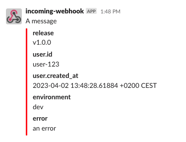

# slog: Slack handler

[](https://github.com/samber/slog-slack/releases)

[](https://pkg.go.dev/github.com/samber/slog-slack)

[](https://goreportcard.com/report/github.com/samber/slog-slack)
[](https://codecov.io/gh/samber/slog-slack)
[](https://github.com/samber/slog-slack/graphs/contributors)
[](./LICENSE)

A [Slack](https://slack.com) Handler for [slog](https://pkg.go.dev/golang.org/x/exp/slog) Go library.

**See also:**

- [slog-multi](https://github.com/samber/slog-multi): workflows of `slog` handlers (pipeline, fanout, ...)
- [slog-formatter](https://github.com/samber/slog-formatter): `slog` attribute formatting
- [slog-datadog](https://github.com/samber/slog-datadog): A `slog` handler for `Datadog`
- [slog-logstash](https://github.com/samber/slog-logstash): A `slog` handler for `Logstash`
- [slog-loki](https://github.com/samber/slog-loki): A `slog` handler for `Loki`
- [slog-sentry](https://github.com/samber/slog-sentry): A `slog` handler for `Sentry`
- [slog-fluentd](https://github.com/samber/slog-fluentd): A `slog` handler for `Fluentd`
- [slog-syslog](https://github.com/samber/slog-syslog): A `slog` handler for `Syslog`

## 🚀 Install

```sh
go get github.com/samber/slog-slack
```

**Compatibility**: go >= 1.20.1

This library is v0 and follows SemVer strictly. On `slog` final release (go 1.21), this library will go v1.

No breaking changes will be made to exported APIs before v1.0.0.

## 💡 Usage

GoDoc: [https://pkg.go.dev/github.com/samber/slog-slack](https://pkg.go.dev/github.com/samber/slog-slack)

### Handler options

```go
type Option struct {
	// log level (default: debug)
	Level slog.Leveler

	// slack webhook url
	WebhookURL string
	// slack channel (default: webhook channel)
	Channel string
	// bot username (default: webhook username)
	Username string
	// bot emoji (default: webhook emoji)
	IconEmoji string
	// bot emoji (default: webhook emoji)
	IconURL string

	// optional: customize Slack message builder
	Converter Converter
}
```

Attributes will be injected in message attachments.



### Example

```go
import (
	slogslack "github.com/samber/slog-slack"
	"golang.org/x/exp/slog"
)

func main() {
    webhook := "https://hooks.slack.com/services/xxx/yyy/zzz"
    channel := "alerts"

    logger := slog.New(slogslack.Option{Level: slog.LevelError, WebhookURL: webhook, Channel: channel}.NewSlackHandler())
    logger = logger.
        With("environment", "dev").
        With("release", "v1.0.0")

    // log error
    logger.
        With("category", "sql").
        With("query.statement", "SELECT COUNT(*) FROM users;").
        With("query.duration", 1*time.Second).
        With("error", fmt.Errorf("could not count users")).
        Error("caramba!")

    // log user signup
    logger.
        With(
            slog.Group("user",
                slog.String("id", "user-123"),
                slog.Time("created_at", time.Now()),
            ),
        ).
        Info("user registration")
}
```

## 🤝 Contributing

- Ping me on twitter [@samuelberthe](https://twitter.com/samuelberthe) (DMs, mentions, whatever :))
- Fork the [project](https://github.com/samber/slog-slack)
- Fix [open issues](https://github.com/samber/slog-slack/issues) or request new features

Don't hesitate ;)

```bash
# Install some dev dependencies
make tools

# Run tests
make test
# or
make watch-test
```

## 👤 Contributors


## 💫 Show your support

Give a ⭐️ if this project helped you!

[](https://github.com/sponsors/samber)

## 📝 License

Copyright © 2023 [Samuel Berthe](https://github.com/samber).

This project is [MIT](./LICENSE) licensed.
